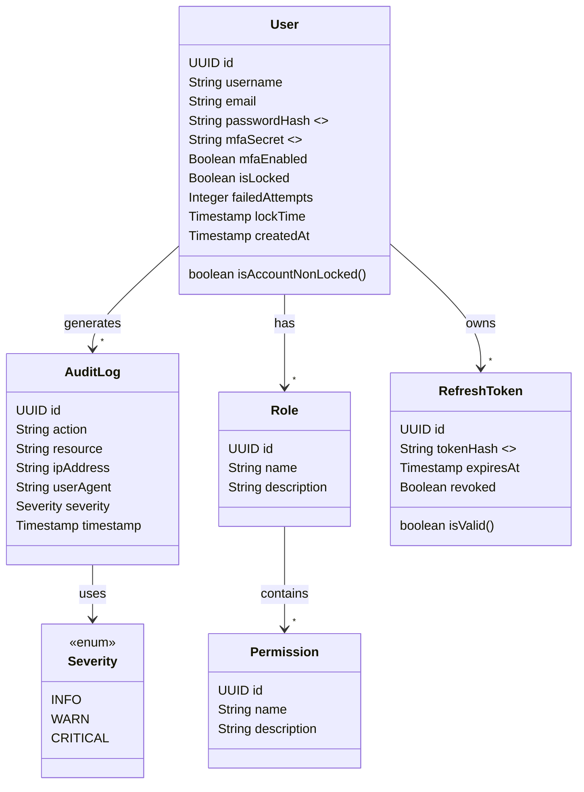
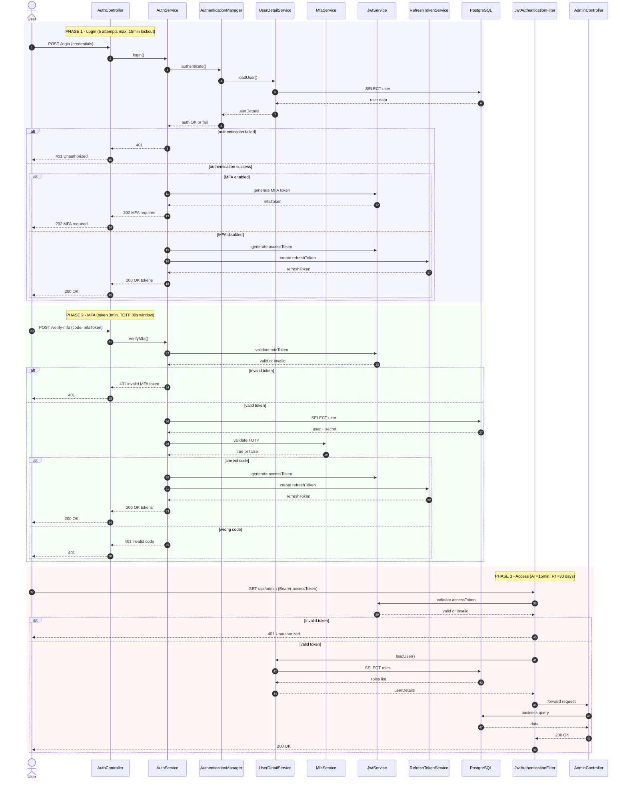

# 🛡️ Gatekeeper IAM: Zero Trust Identity Provider

<div align="center">
  <h3>The Fortress of Digital Identity</h3>
  <p>Un service d’authentification ultra-sécurisé, stateless et auditable construit avec Spring Boot 3 & PostgreSQL.</p>
</div>

---

# 📝 Project Overview

Gatekeeper est bien plus qu’un simple serveur de connexion :
c’est un **Identity Provider Zero Trust**.

Il externalise l’authentification et l’autorisation de vos applications, assurant que même en cas de vol de token ou de compromission BD, un attaquant **ne peut ni imiter un utilisateur ni lire des secrets sensibles**.

---

# 🎯 Core Objectives

* **Centralized Security** – Une porte d’entrée unique pour toutes vos apps.
* **Defense in Depth** – Chiffrement, hashing, MFA, verrouillage intelligent.
* **Stateless Architecture** – Scalabilité totale via JWT.

---

# 🔒 Extreme Security Features

| Feature                    | Implementation                   | Why it matters                                   |
| -------------------------- | -------------------------------- | ------------------------------------------------ |
| **Memory-Hard Hashing**    | Argon2id (4MB RAM, 3 iterations) | Rend les attaques GPU impossibles économiquement |
| **Transparent Encryption** | AES-256 GCM                      | Même un dump BD ne révèle rien                   |
| **MFA**                    | TOTP (Google Authenticator)      | Empêche les prises de contrôle                   |
| **Secure Sessions**        | Refresh tokens hashés (SHA-256)  | Un voleur de BD ne peut pas voler les sessions   |
| **Attack Prevention**      | Rate limiting + lockout          | Bloque les IP malveillantes                      |

---

# 🛠️ Technology Stack

* **Core** : Java 17, Spring Boot 3.3, Spring Security 6
* **Database** : PostgreSQL 16
* **Cryptography** : Bouncy Castle, AES-GCM
* **Tokens** : JWT (Nimbus JOSE)
* **Build Tool** : Maven

---

# 🏛️ Architecture & Design

## 1. Domain Model (Class Diagram)



> Notes:
>
> * All PKs are UUIDs for immutability and cross-service safety.
> * Sensitive fields (mfaSecret, others) are stored encrypted (AES-GCM).
> * Passwords hashed with Argon2id.

---

## 2. Secure Login Flow (Sequence Diagram)

This sequence diagram is fully compatible with GitHub's Mermaid. It:

* splits the flow into **Phase 1 (Login Initial)**, **Phase 2 (MFA Verification)**, **Phase 3 (Access with Token)** using `rect` blocks,
* adds a `note over` for each phase listing the **limits** and important constraints (token lifetimes, lockout thresholds),
* uses consistent lowercase participant ids to avoid GitHub Mermaid parsing issues.



### Why this version works on GitHub

* uses `participant` with lowercase IDs — GitHub's Mermaid parser is picky about capitalization/aliasing.
* groups phases using `rect` and gives each a `note` describing limits and policies.
* avoids unsupported PlantUML constructs; uses only Mermaid sequence syntax.

---

# 🚀 Getting Started

## Prerequisites

* Docker
* Java 17+
* Maven

---

## Installation

```bash
git clone https://github.com/your-username/gatekeeper-iam.git
cd gatekeeper-iam
```

---

## Start the Database

```bash
docker run --name gatekeeper-db \
 -e POSTGRES_USER=gatekeeper_admin \
 -e POSTGRES_PASSWORD=extreme_secret_pass \
 -e POSTGRES_DB=gatekeeper_iam \
 -p 5432:5432 \
 -d postgres:16-alpine
```

---

## Environment Variables

Create a `.env` file:

```
GATEKEEPER_ENCRYPTION_KEY=Your32CharLongSecretKeyForAES256!!
GATEKEEPER_JWT_SECRET=YourVeryLongSecretKeyForSigningJWTs
```

---

## Run the Application

```bash
mvn spring-boot:run
```

---

# 📡 API Endpoints

| Method | Endpoint             | Description             | Auth |
| ------ | -------------------- | ----------------------- | ---- |
| POST   | /api/auth/register   | Create account          | ❌    |
| POST   | /api/auth/login      | Login + MFA flow        | ❌    |
| POST   | /api/auth/verify-mfa | Confirm MFA             | ⚠️   |
| POST   | /api/auth/refresh    | New access token        | ❌    |
| POST   | /api/auth/logout     | Revoke refresh token    | ✅    |
| GET    | /api/demo            | Test protected endpoint | ✅    |

---

# 🛡️ Security Audit Log (Roadmap)

* **Sprint 0** : Crypto hardening (AES, Argon2)
* **Sprint 1** : Core Auth + JWT
* **Sprint 2** : Registration + Logout
* **Sprint 3** : MFA + Zero Trust login

---

<div align="center">
  <sub>Built with ❤️ and paranoia by Zakaria.</sub>
</div>

---
